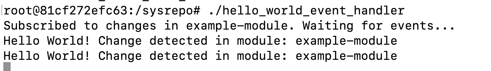
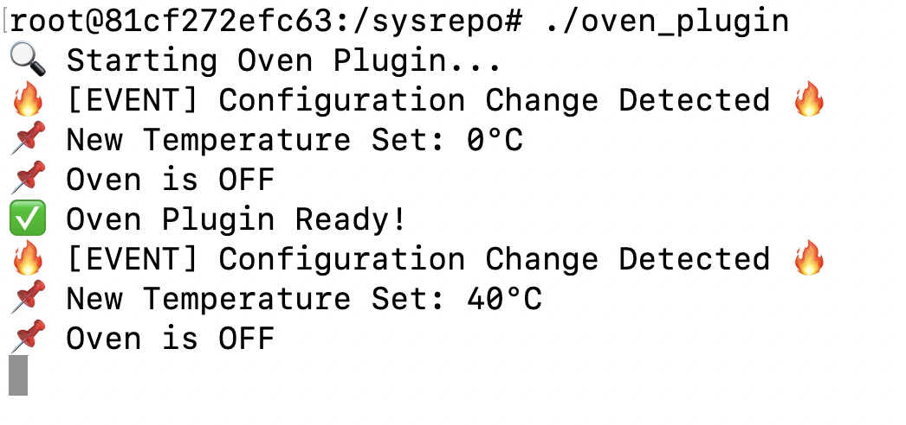
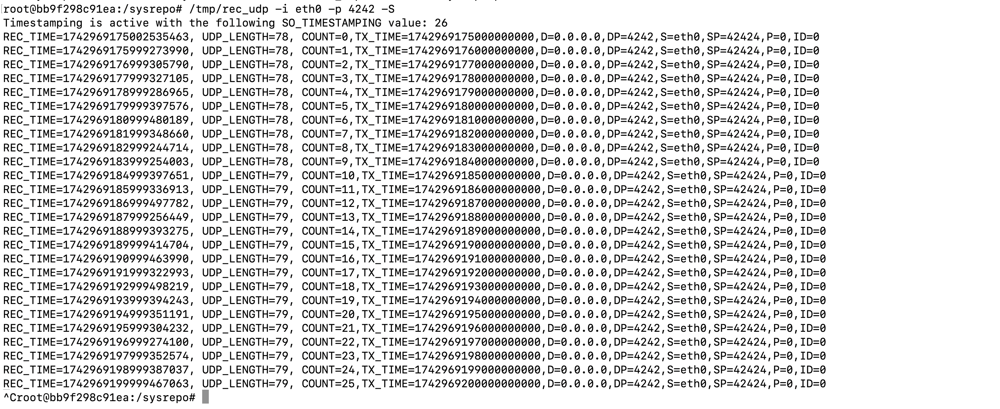
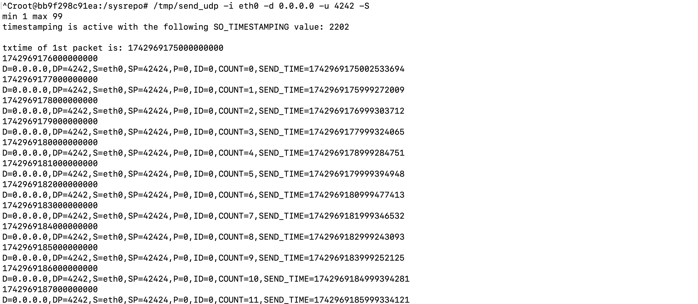

# ⏱️ Time-Sensitive Networking (TSN) Host Prototype

A C-based prototype of a TSN-capable host that supports real-time UDP communication and remote configuration using Sysrepo, Netopeer2, and YANG/NETCONF.

> 🧪 Master's Project at Universität Rostock  
> 👩‍💻 Developed by: Essraa Hassanin

---

## 📌 Overview

This project demonstrates a Time-Sensitive Networking (TSN) end-host system capable of:

- Real-time communication over UDP using Linux socket APIs
- Dynamic configuration via Sysrepo & Netopeer2
- Event-driven behavior via C-based plugin modules
- Dockerized deployment

---

## ⚙️ Key Modules

### 🔹 Hello World Plugin
- Detects config changes in YANG model
- Prints log on update

### 🔹 Oven Plugin
- Reacts to oven temperature/power changes
- Warns if unsafe values detected

### 🔹 UDP Communication
- Sender: `SO_TXTIME` to schedule packets
- Receiver: `SO_TIMESTAMPING` to log timestamps

---

## 🛠️ Technologies Used

- C, UDP, Linux Sockets  
- Sysrepo, Netopeer2, YANG/NETCONF  
- Docker  
- Ubuntu Linux

---

## 📂 Folder Structure

<pre>
  ├── hello_world_event_handler.c
  ├── oven_event_handler.c
  ├── example-config.xml
  ├── oven-config.xml
  ├── Dockerfile
  ├── TSN.pdf
  ├── assets/
  │ ├── hello_world_output.png
  │ ├── oven_plugin_output.png
  │ ├── udp_rec.png
  │ └── udp_send.png
  └── README.md
</pre>

---

## 📸 Sample Output

### 🔹 Hello World Plugin

### 🔹 Oven Plugin

### 🔹 UDP Receiver

### 🔹 UDP Sender

---

## 📘 Report

📄 Full documentation: [`TSN.pdf`](TSN.pdf)

